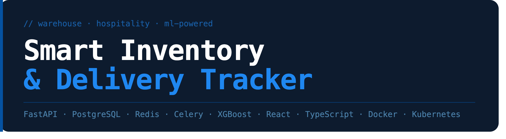

# Smart Inventory & Delivery Tracker

Production-grade inventory and delivery tracking platform for warehouse operations, with ML-powered demand forecasting and anomaly detection.

**Stack:** FastAPI · PostgreSQL · Redis · Celery · XGBoost · scikit-learn · React · TypeScript · TailwindCSS · Docker · GitHub Actions

---

## Features

- Inventory CRUD with stock movement audit trail and reorder alerts
- Inbound delivery tracking with enforced state machine — marking delivered auto-updates stock
- ML demand forecasting per product (XGBoost) — predicts stockout date and reorder quantity
- Anomaly detection (Isolation Forest) flags unusual stock patterns
- Analytics dashboard — stock by category, delivery breakdown, 30-day movement trend
- Role-based access control — admin, warehouse staff, driver
- Background jobs via Celery + Redis with response caching
- 60 tests, CI via GitHub Actions

---

## Quick Start

```bash
git clone git@github.com:AEX8/smart-inventory.git
cd smart-inventory
cp backend/.env.example backend/.env
docker compose up --build
docker compose exec backend alembic upgrade head
docker compose exec backend python seed.py
cd frontend && npm install && npm run dev
```

Open `http://localhost:5173`

**Default logins:**
| Email | Password | Role |
|---|---|---|
| admin1@test.com | password123 | Admin |
| staff1@test.com | password123 | Warehouse Staff |
| driver1@test.com | password123 | Driver |

---

## Testing

```bash
docker compose exec backend pytest -v
```

---
